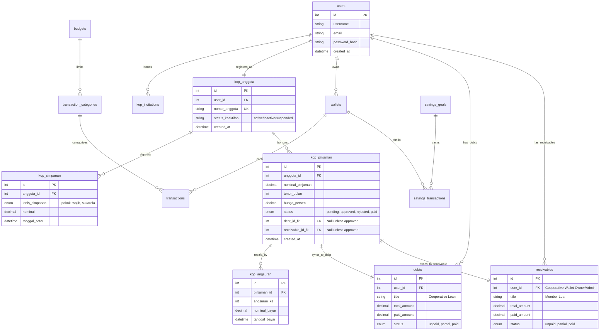
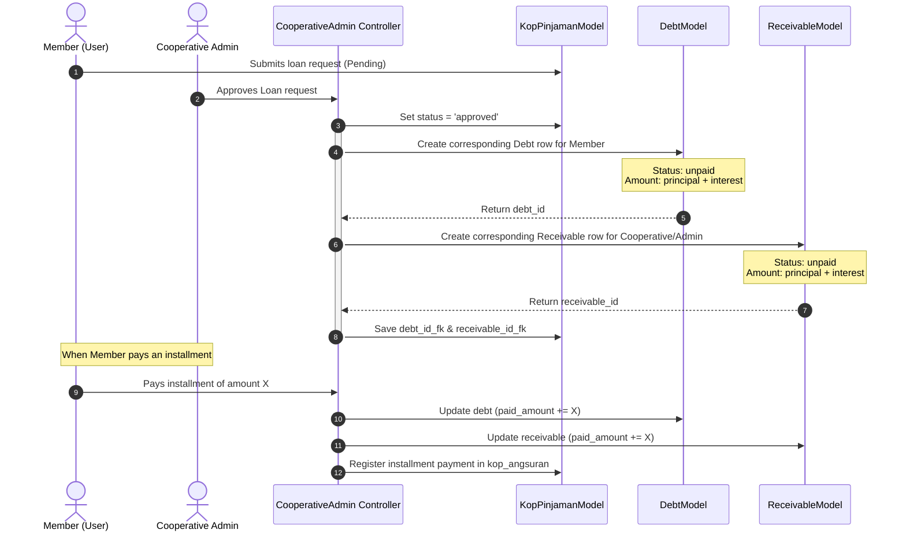

# 🗺️ Catatan Application Architectural Map

This document presents a comprehensive, production-grade architectural blueprint and dependency map for **Catatan**—a personal finance manager integrated with a cooperative credit union (**Koperasi Simpan Pinjam**) module built on the CodeIgniter 4 framework.

---

## 🏗️ 1. High-Level System Architecture

The application is structured around a classic Model-View-Controller (MVC) architectural pattern, enhanced with **CodeIgniter Shield** for role-based access control and custom filters to separate **Admin/Manager** roles from **Standard Users (Members)**.

```mermaid
graph TD
    %% Styling
    classDef route fill:#F9E79F,stroke:#D4AC0D,stroke-width:2px;
    classDef filter fill:#EDBB99,stroke:#D35400,stroke-width:2px;
    classDef controller fill:#AED6F1,stroke:#2E86C1,stroke-width:2px;
    classDef model fill:#A2D9CE,stroke:#17A589,stroke-width:2px;
    classDef view fill:#D7BDE2,stroke:#884EA1,stroke-width:2px;
    classDef external fill:#E5E7E9,stroke:#7F8C8D,stroke-width:1px;

    %% Elements
    Client([🌐 Web Client])
    Routes[Config/Routes.php]:::route
    AuthFilter[Filters/AdminAuthFilter.php]:::filter
    Shield[Shield Auth Middleware]:::filter

    %% Controllers
    subgraph Controllers [Controllers Layer]
        C_Base[BaseController.php]:::controller
        C_Admin[Admin.php]:::controller
        C_CoopAdmin[CooperativeAdmin.php]:::controller
        C_CoopMember[CooperativeMember.php]:::controller
        C_Tx[Transaction.php]:::controller
        C_Wallet[Wallet.php]:::controller
        C_Savings[Savings.php]:::controller
        C_Debt[DebtReceivable.php]:::controller
    end

    %% Models
    subgraph Models [Models Layer]
        M_User[UserModel.php]:::model
        M_Tx[TransactionModel.php]:::model
        M_Wallet[WalletModel.php]:::model
        M_Goal[SavingsGoalModel.php]:::model
        M_KopAnggota[KopAnggotaModel.php]:::model
        M_KopPinjaman[KopPinjamanModel.php]:::model
        M_KopSimpanan[KopSimpananModel.php]:::model
        M_KopAngsuran[KopAngsuranModel.php]:::model
        M_Debt[DebtModel.php]:::model
        M_Receivable[ReceivableModel.php]:::model
    end

    %% Views
    subgraph Views [Presentation Layer]
        L_Base[Layouts/base.php]:::view
        L_Admin[Layouts/admin_base.php]:::view
        V_Coop[user/cooperative/loans.php]:::view
        V_CoopAdmin[admin/cooperative/members.php]:::view
    end

    %% Database
    subgraph Data [Data Tier]
        DB[(MySQL Database)]
    end

    %% Libraries
    DomPDF([📄 Dompdf]):::external
    PhpSpreadsheet([📊 PhpSpreadsheet]):::external

    %% Connections
    Client -->|HTTP Requests| Routes
    Routes --> Shield
    Shield --> AuthFilter
    AuthFilter --> C_Admin
    AuthFilter --> C_CoopAdmin
    
    %% Base Controller Inheritance
    C_Base <|-- C_Admin
    C_Base <|-- C_CoopAdmin
    C_Base <|-- C_CoopMember
    C_Base <|-- C_Tx
    
    %% Controller to Model relationships
    C_CoopAdmin --> M_KopAnggota
    C_CoopAdmin --> M_KopSimpanan
    C_CoopAdmin --> M_KopPinjaman
    C_CoopMember --> M_KopPinjaman
    C_CoopMember --> M_KopSimpanan
    C_CoopMember --> M_KopAngsuran
    C_Tx --> M_Tx
    C_Tx --> M_Wallet
    C_Debt --> M_Debt
    C_Debt --> M_Receivable
    
    %% Integrations & Outputs
    C_CoopAdmin -->|Generates PDF| DomPDF
    C_CoopAdmin -->|Exports Report| PhpSpreadsheet
    
    %% Sync flows
    M_KopPinjaman -.->|Triggers sync to| M_Debt
    M_KopPinjaman -.->|Triggers sync to| M_Receivable
    
    %% Model to DB
    Models --> DB
    
    %% View Rendering
    C_CoopMember -->|renders| V_Coop
    C_CoopAdmin -->|renders| V_CoopAdmin
    V_Coop --> L_Base
    V_CoopAdmin --> L_Admin
```

---

## 🗄️ 2. Database Schema (Entity Relationships)

The application beautifully marries **Personal Finance Tracking** (Wallets, Budgets, Savings, Debts) with the **Cooperative Credit Union** module.



---

## 🔄 3. Two-Way Sync Logic: Cooperative & Personal Ledger

A standout design element in this application is the synchronization engine connecting the **Cooperative loan** status to **Personal debts/receivables**.



---

## 🛠️ 4. Modular Codebase Summary

### 📂 Configuration Layer (`app/Config/`)
- **`Routes.php`**: Manages all SEO-friendly URLs. Contains dedicated routing blocks for `/admin/cooperative/*` and `/user/cooperative/*`.
- **`AuthGroups.php`**: Defines Shield permissions, mapping user groups (e.g., `admin`, `manager`, `member`).

### 📂 Controller Layer (`app/Controllers/`)
- **`CooperativeAdmin.php`**: Core controller for managing members, verifying invitation codes, registering deposits, validating loan requests, and outputting PDF summaries via Dompdf.
- **`CooperativeMember.php`**: Handles client-side cooperative hub dashboard, tracking deposits, filling out loan requests, and listing installment schedules.
- **`Transaction.php` & `Wallet.php`**: Handlers for personal finance accounting.

### 📂 Model Layer (`app/Models/`)
- **`KopAnggotaModel.php`**: Manages membership codes, validation, and user profile relationships.
- **`KopPinjamanModel.php`**: Business rules for interest calculation, amortization schedule generators, and status modifications.
- **`KopSimpananModel.php`**: Categorizes and aggregates Pokok, Wajib, and Sukarela savings pools.

### 📂 View Layer (`app/Views/`)
- **`layouts/base.php`**: Standard premium responsive layout for members, utilizing a dark mode utility via HSL tailored design.
- **`layouts/admin_base.php`**: Specialized dashboard layout for the admin view containing sidebar, audit monitors, and metrics.
- **`user/cooperative/loans.php`**: Interactive simulation forms for members to compute interest and amortization before requesting a loan.

---

### 🎨 Design Highlights
* **HSL Color System**: Sleek glassmorphism and tailormade deep primary hues (`hsl(222.2, 47.4%, 11.2%)` for dark mode base) mapped directly inside the master stylesheets.
* **Micro-Animations**: Hover-triggered translations, dynamic load states, and full screen cinematic overlays for administrative operations.
