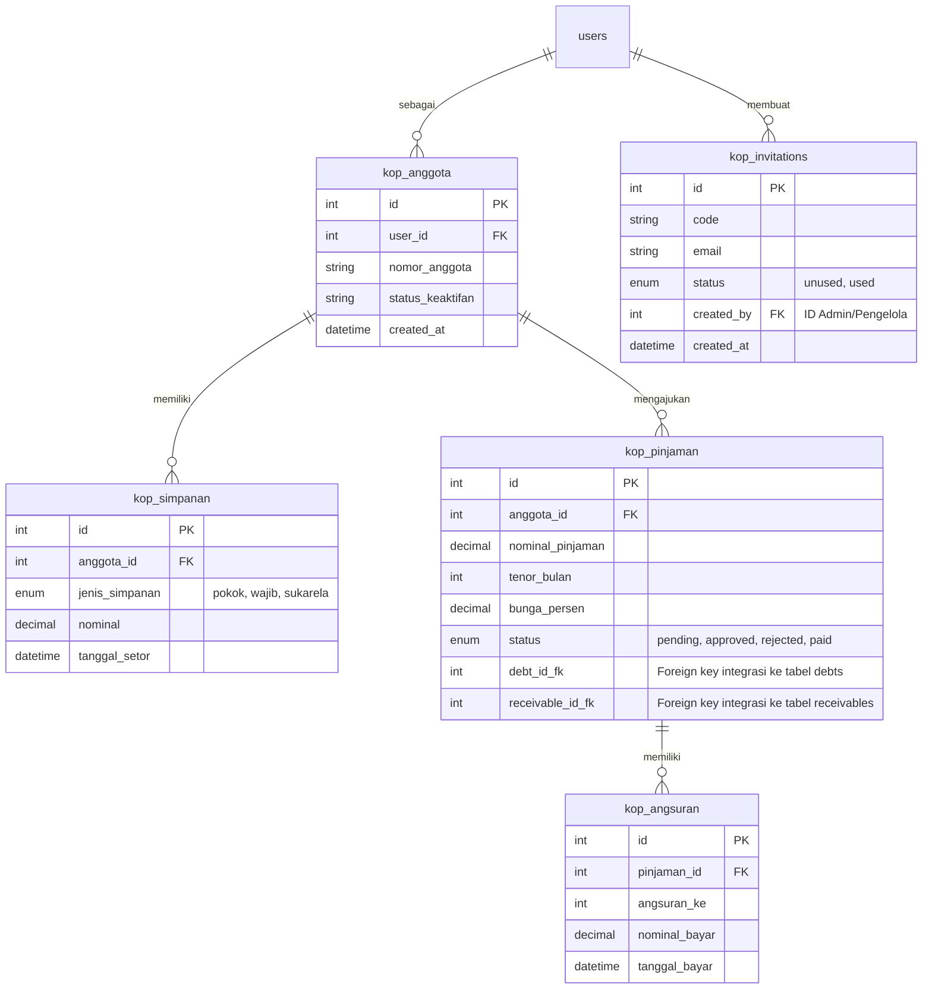

# 🏢 Rencana & Analisis Fitur Koperasi Simpan Pinjam
## Integrasi dengan Modul Utang Piutang (`debt_receivable`)

Dokumen ini menyajikan analisis arsitektur, daftar menu yang wajib ada, serta logika integrasi data untuk pengembangan fitur baru **Koperasi Simpan Pinjam** yang memisahkan peran antara **Pengelola Koperasi (Manager/Admin)** dan **Anggota Koperasi (User/Member)**.

---

## 🔗 1. Konsep Dasar Integrasi dengan `debt_receivable`

Dalam dunia koperasi simpan pinjam, pencatatan pinjaman memiliki sifat **timbal balik (two-way synchronization)** yang sangat pas diintegrasikan dengan modul utang piutang yang telah kita buat sebelumnya:

*   **Bagi Koperasi (Pengelola)**: Pinjaman yang disalurkan kepada anggota adalah **Piutang (Receivable)**.
*   **Bagi Anggota (User)**: Pinjaman yang diterima dari koperasi adalah **Utang (Debt)**.
*   **Logika Otomatisasi (Integration Rules)**:
    1.  Saat Pengelola menyetujui pengajuan pinjaman anggota sebesar $X$, sistem akan otomatis membuat baris baru di tabel `receivables` milik Koperasi (tipe: `receivable`, status: `unpaid`).
    2.  Di saat yang bersamaan, sistem otomatis membuat baris baru di tabel `debts` milik Anggota tersebut (tipe: `debt`, status: `unpaid`).
    3.  Setiap kali anggota membayar angsuran cicilan, sisa utang di sisi anggota dan sisa piutang di sisi koperasi akan otomatis berkurang (*partial payment*), hingga akhirnya berubah status menjadi lunas (*paid*).

---

## 👑 A. STRUKTUR MENU PENGELOLA KOPERASI (Admin/Manager Panel)
*Menu khusus bagi pengurus koperasi untuk memantau kas, mengelola simpanan, dan menyalurkan pinjaman.*

### 1. Dasbor Analitik Koperasi (Cooperative Dashboard)
*   **Metrik Ringkasan Utama**:
    *   **Total Kas Koperasi**: Akumulasi saldo simpanan pokok, wajib, dan sukarela yang tersimpan.
    *   **Total Piutang Aktif**: Jumlah dana pinjaman yang sedang beredar di tangan anggota.
    *   **Tingkat NPL (Non-Performing Loan)**: Persentase pinjaman yang menunggak (jatuh tempo terlewati namun belum lunas).
    *   **Jumlah Anggota Aktif**: Total anggota koperasi terdaftar.
*   **Grafik Tren Bulanan**:
    *   Tren masuknya simpanan vs penyaluran pinjaman baru.

### 2. Manajemen Anggota (Member Directory)
*   **Registrasi Berbasis Undangan (Invitation-Only Registration)**: Pengguna wajib menyertakan **Kode Undangan (Invitation Code)** unik untuk mendaftar sebagai anggota koperasi. Kode undangan ini hanya dapat digenerate dan didistribusikan oleh Admin atau Pengelola Koperasi. Pengguna tidak diperbolehkan mendaftar secara mandiri dan bebas tanpa undangan ini.
*   **Daftar Anggota**: Data profil lengkap anggota (terintegrasi dengan tabel `users` utama).
*   **Persetujuan Keanggotaan (Membership Approval)**: Validasi pendaftaran anggota baru yang masuk via jalur undangan dan verifikasi berkas pendukung.
*   **Status Keaktifan**: Memblokir sementara hak pinjam anggota jika memiliki catatan kredit buruk.

### 3. Menu Kelola Simpanan Anggota (Savings Management)
*   **Pencatatan Setoran Simpanan**:
    *   **Simpanan Pokok**: Setoran awal wajib saat terdaftar (dibayar 1x).
    *   **Simpanan Wajib**: Setoran rutin bulanan (nominal flat ditentukan koperasi).
    *   **Simpanan Sukarela**: Setoran bebas kapan saja yang bertindak seperti tabungan biasa (bisa ditarik kapan saja).
*   **Approval Penarikan Simpanan Sukarela**: Validasi ketika anggota mengajukan penarikan dana tabungan sukarela mereka.

### 4. Menu Kelola Pinjaman & Persetujuan (Loan & Approval Workflow)
*   **Daftar Pengajuan Pinjaman (Loan Requests)**: Antrean pengajuan pinjaman masuk dari anggota (menampilkan nominal, tujuan pinjam, dan tenor cicilan).
*   **Tombol Aksi Persetujuan (Approval Button)**:
    *   **Setujui (Approve)**: Dana ditransfer ➔ Otomatis memicu integrasi **Piutang Koperasi** & **Utang Anggota**.
    *   **Tolak (Reject)**: Pengajuan dibatalkan disertai alasan penolakan.
*   **Simulasi & Penjadwalan Cicilan (Amortization Schedule)**: Generator otomatis tanggal jatuh tempo cicilan per bulan berdasarkan tenor (misal: 6 bulan, 12 bulan).

### 5. Menu Pencatatan Angsuran (Installment Tracker)
*   **Form Terima Angsuran**: Form untuk mencatat cicilan bulanan yang dibayar oleh anggota.
*   **Alokasi Pembayaran**: Membagi uang cicilan menjadi Pembayaran Pokok Pinjaman dan Bunga Pinjaman (pendapatan jasa koperasi).

---

## 👥 B. STRUKTUR MENU ANGGOTA KOPERASI (Member Panel)
*Menu khusus yang diakses oleh user biasa untuk memantau tabungan dan membayar pinjaman mereka.*

### 1. Dasbor Koperasi Saya (My Cooperative Hub)
*   **Total Simpanan Saya**: Akumulasi tabungan Pokok + Wajib + Sukarela milik user di koperasi.
*   **Sisa Pinjaman Saya**: Sisa pokok utang yang wajib dilunasi.
*   **Jadwal Jatuh Tempo**: Peringatan tanggal pembayaran cicilan berikutnya agar tidak terkena denda.

### 2. Tabungan & Simpanan Saya (My Savings & Deposits)
*   **Informasi Detail Saldo**: Rincian saldo per jenis simpanan.
*   **Histori Transaksi Tabungan**: Riwayat setoran simpanan bulanan dan penarikan yang pernah dilakukan.
*   **Form Tarik Simpanan Sukarela**: Pengajuan pencairan dana simpanan sukarela secara mandiri ke pengelola.

### 3. Pinjaman & Angsuran Saya (My Active Loans)
*   **Formulir Pengajuan Pinjaman Baru**: Anggota mengajukan pinjaman dengan mengisi nominal, jangka waktu (tenor), dan melampirkan berkas jaminan/alasan pinjam.
*   **Histori Cicilan**: Daftar pembayaran angsuran bulanan yang telah berhasil disetor beserta sisa tenor (misal: "Cicilan ke-3 dari 12").
*   **Rincian Suku Bunga**: Transparansi perhitungan bunga flat atau anuitas per bulan.

---

## ⚙️ 3. Rekomendasi Struktur Tabel Database Pendukung
*Untuk mendukung fitur ini tanpa merusak tabel transaksi utama, disarankan membuat 4 tabel tambahan berikut:*

