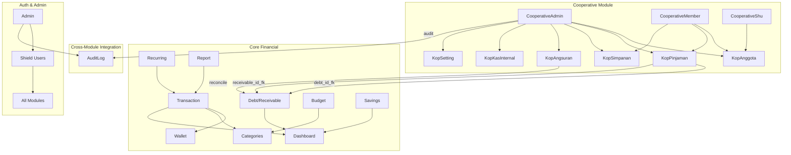

# 📊 GRAPHIFY PROJECT SKILL — Catatan Keuangan (CodeIgniter 4)

> **Project Name:** Catatan Keuangan + Koperasi Simpan Pinjam
> **Stack:** CodeIgniter 4.6.5 · PHP 8.1 · MySQL · TailwindCSS v4 · Vite · Shield Auth
> **Last Updated:** 2026-05-20

---

## 🧠 AI Boot Context

Sebelum membuat perubahan apapun, AI wajib:

1. Baca `app/Config/Routes.php` — semua route dan filter terdefinisi di sini
2. Baca `composer.json` — dependency: Shield (auth), DomPDF, PhpSpreadsheet
3. Baca `package.json` — Tailwind CSS v4.3 via `@tailwindcss/cli`
4. Periksa `app/Config/Filters.php` — filter `user_auth` dan `admin_auth`
5. Periksa `app/Database/Migrations/` — 18+ migration files menentukan schema

---

## 🏗️ Architecture Overview

```
┌─────────────────────────────────────────────────────────┐
│                    PRESENTATION LAYER                    │
│  Views: layouts/ → base.php, admin_base.php,            │
│         koprasi_base.php, admin_cooperative_base.php     │
│  User Views: user/ (dashboard, transactions, etc.)      │
│  Admin Views: admin/ (dashboard, cooperative/)           │
│  Frontend: TailwindCSS v4, Vanilla JS, Mobile-First     │
├─────────────────────────────────────────────────────────┤
│                    CONTROLLER LAYER                      │
│  15 Controllers (app/Controllers/)                      │
│  Auth Filters: UserAuthFilter, AdminAuthFilter          │
│  Auth: CodeIgniter Shield (session-based)               │
├─────────────────────────────────────────────────────────┤
│                    MODEL / DATA LAYER                    │
│  21 Models (app/Models/)                                │
│  Prefix: Kop* = Koperasi module                         │
│  Pattern: CI4 Model (allowedFields, protectFields)      │
│  Static helpers: KopSettingModel, AuditLogModel         │
├─────────────────────────────────────────────────────────┤
│                    DATABASE LAYER                        │
│  MySQL via CI4 Database Forge                           │
│  18 Migration files                                     │
│  Key-Value Settings: kop_settings table                 │
└─────────────────────────────────────────────────────────┘
```

---

## 📂 Project Structure

```
catatan/
├── app/
│   ├── Config/
│   │   ├── Routes.php          # All route definitions
│   │   ├── Filters.php         # Filter aliases & URI mappings
│   │   └── Auth.php            # Shield auth config
│   ├── Controllers/            # 15 controllers
│   │   ├── Home.php            # User dashboard
│   │   ├── Transaction.php     # Income/expense CRUD
│   │   ├── Category.php        # Category management
│   │   ├── DebtReceivable.php  # Debt & receivable tracking
│   │   ├── Profile.php         # User profile
│   │   ├── Report.php          # Financial reports & export
│   │   ├── Budget.php          # Monthly budget limits
│   │   ├── Recurring.php       # Recurring transactions
│   │   ├── Wallet.php          # Multi-wallet management
│   │   ├── Savings.php         # Savings goals planner
│   │   ├── Admin.php           # Admin panel + impersonation
│   │   ├── CooperativeAdmin.php  # Coop admin management (50KB+)
│   │   ├── CooperativeMember.php # Coop member portal
│   │   └── CooperativeShu.php    # SHU (profit sharing)
│   ├── Models/                 # 21 models
│   │   ├── TransactionModel.php
│   │   ├── DebtModel.php / ReceivableModel.php
│   │   ├── WalletModel.php
│   │   ├── SavingsGoalModel.php
│   │   ├── Kop*.php            # 8 cooperative models
│   │   ├── AuditLogModel.php   # Static audit logging
│   │   └── UserModel.php       # Extends Shield
│   ├── Filters/
│   │   ├── UserAuthFilter.php  # Login check (no role redirect)
│   │   └── AdminAuthFilter.php # Admin/manager gate
│   ├── Views/
│   │   ├── layouts/            # 4 base layouts
│   │   ├── user/               # 10+ user view directories
│   │   ├── admin/              # Admin views + cooperative/
│   │   └── Shield/             # Auth views override
│   └── Database/Migrations/    # 18 migration files
├── public/
│   ├── css/app.css             # Compiled Tailwind output
│   └── uploads/                # User uploads
├── resources/
│   └── css/app.css             # Tailwind source
├── composer.json               # PHP dependencies
├── package.json                # Node dependencies
└── graphify-out/               # Project knowledge graph
```

---

## 🔀 Route Map

### User Routes (filter: `user_auth`)
| Route Group      | Controller            | Key Methods                           |
|------------------|-----------------------|---------------------------------------|
| `/`              | Home                  | index (dashboard)                     |
| `/transaction`   | Transaction           | index, create, update, delete         |
| `/category`      | Category              | index, create, delete                 |
| `/debt-receivable`| DebtReceivable       | index, createDebt, createReceivable   |
| `/profile`       | Profile               | index, update, deleteAvatar           |
| `/reports`       | Report                | index, chartData, export              |
| `/budgets`       | Budget                | index, setLimit, delete               |
| `/recurring`     | Recurring             | index, create, toggle, delete         |
| `/wallets`       | Wallet                | index, create, transfer               |
| `/savings`       | Savings               | index, create, allocate               |
| `/cooperative`   | CooperativeMember     | index, join, savings, loans, bills    |

### Admin Routes (filter: `admin_auth`)
| Route Group            | Controller          | Key Methods                              |
|------------------------|---------------------|------------------------------------------|
| `/admin`               | Admin               | index, login, impersonate, auditLogs     |
| `/admin/cooperative`   | CooperativeAdmin    | members, loans, savings, installments    |
|                        |                     | settings, funds, directLoanForm          |
| `/admin/cooperative`   | CooperativeShu      | adminIndex, distribute                   |

---

## 🗃️ Database Schema Map

### Core Financial Tables
| Table               | Purpose                        | Key Relations                   |
|---------------------|--------------------------------|---------------------------------|
| `users`             | Shield user accounts           | Base for all ownership          |
| `transactions`      | Income/expense records         | → users, wallets, categories    |
| `income_categories` | Income category master         | → transactions                  |
| `expense_categories`| Expense category master        | → transactions                  |
| `debts`             | User debts                     | → users, debt_payments          |
| `debt_payments`     | Debt payment records           | → debts                        |
| `receivables`       | Money owed to user             | → users, receivable_payments    |
| `receivable_payments`| Receivable payment records    | → receivables                   |
| `budgets`           | Monthly budget limits          | → users, expense_categories     |
| `wallets`           | Multi-wallet accounts          | → users                        |
| `savings_goals`     | Savings targets                | → users                        |
| `savings_transactions`| Savings allocation log       | → savings_goals                 |
| `recurring_transactions`| Auto-repeat transactions   | → users                        |

### Cooperative (Koperasi) Tables
| Table               | Purpose                        | Key Relations                   |
|---------------------|--------------------------------|---------------------------------|
| `kop_anggota`       | Membership records             | → users                        |
| `kop_invitation`    | Join invitation codes          | → users (created_by)           |
| `kop_simpanan`      | Savings (wajib/sukarela)       | → kop_anggota                  |
| `kop_pinjaman`      | Loan records                   | → kop_anggota, debts, receivables|
| `kop_angsuran`      | Installment payments           | → kop_pinjaman                 |
| `kop_kas_internal`  | Internal cash ledger           | → kas_utama / dana_talangan    |
| `kop_settings`      | Key-value system settings      | VARCHAR PK (key)               |
| `kop_shu_history`   | SHU distribution history       | → kop_anggota                  |
| `audit_logs`        | System-wide audit trail        | → users                        |

---

## 🔐 Authentication & Authorization

### Auth Stack
- **Library:** CodeIgniter Shield v1.3
- **Strategy:** Session-based authentication
- **Registration:** Standard Shield flow (`/register`, `/login`)

### User Roles (Shield Groups)
| Role        | Access Level                                  |
|-------------|-----------------------------------------------|
| `user`      | All `/user` routes, `/cooperative` member     |
| `manager`   | `user` + `/admin/cooperative` management      |
| `admin`     | `manager` + `/admin` panel + settings         |
| `superadmin`| `admin` + role assignment + impersonation     |

### Auth Filters
| Filter        | Applied To              | Behavior                              |
|---------------|-------------------------|---------------------------------------|
| `user_auth`   | `/`, `/transaction`, etc| Requires login (any role)             |
| `admin_auth`  | `/admin/*`              | Requires admin/superadmin/manager     |

---

## 🎨 Frontend Architecture

### CSS Framework
- **TailwindCSS v4.3** via `@tailwindcss/cli`
- Source: `resources/css/app.css`
- Output: `public/css/app.css`
- Build: `npm run build` (cmd wrapper needed on Windows)

### Design System
- **Theme:** Dark mode (slate-950 bg, slate-900 borders)
- **Accent colors:** emerald (success), rose (danger), indigo (info), amber (warning)
- **Typography:** System fonts via Tailwind defaults
- **Components:** Glassmorphism cards, rounded-2xl panels, gradient buttons
- **Animations:** `animate-fade-in`, hover scale effects, transitions
- **Icons:** Inline SVG (Heroicons style)

### Layout Hierarchy
```
layouts/base.php              → User-facing pages (sidebar nav)
layouts/admin_base.php        → Admin panel pages
layouts/koprasi_base.php      → Cooperative member portal
layouts/admin_cooperative_base.php → Admin cooperative management
```

### JavaScript
- **No framework** — Vanilla JS only
- **Pattern:** Inline `<script>` blocks per view
- **Live calculation:** Used in loan simulation, installment forms
- **Form handling:** Standard HTML forms with CSRF + server validation

---

## 📐 Coding Conventions

### PHP / Backend
```php
// Controllers: thin, delegate to models
public function index() {
    $data = $this->someModel->findAll();
    return view('user/module/index', ['data' => $data, 'title' => '...']);
}

// Models: CI4 standard with allowedFields
protected $allowedFields = ['field1', 'field2', ...];

// Static helpers for cross-cutting concerns
AuditLogModel::log('action_name', 'Description...');
KopSettingModel::getSetting('key', 'default');
KopSettingModel::setSetting('key', 'value');

// Naming: snake_case for DB columns, camelCase for PHP methods
// Views: kebab-case or snake_case filenames
// Models: PascalCase with Model suffix
// Controllers: PascalCase matching route names
```

### View Conventions
```php
// Every view extends a layout
<?= $this->extend('layouts/base') ?>
<?= $this->section('content') ?>
  // Content here
<?= $this->endSection() ?>

// Flash messages pattern (used everywhere)
<?php if (session('message')) : ?>
    <div class="bg-emerald-500/10 ...">...</div>
<?php endif ?>

// Form pattern: POST with csrf_field()
<form action="<?= base_url('path') ?>" method="post">
    <?= csrf_field() ?>
    ...
</form>
```

### Database
- **Primary keys:** Auto-increment `id` (integer)
- **Exception:** `kop_settings` uses VARCHAR `key` as PK (`useAutoIncrement = false`)
- **Timestamps:** Mixed — some use CI4 `$useTimestamps`, some manual
- **Soft deletes:** Not used
- **Foreign keys:** Defined in migrations with cascade

---

## 🔗 Module Dependency Map



---

## ⚙️ Key Business Logic

### Loan Calculation Engine
- **Location:** `KopPinjamanModel::calculateLoanDetails()`
- **Reads from:** `kop_settings` table (7 keys)
- **Supports:** Flat & effective (declining) interest, monthly & annual periods
- **Service fees:** Fixed nominal or percentage-based
- **Payment timing:** Upfront deduction or monthly installment
- **Per-loan override:** `bunga_opsi_bayar` and `metode_bayar_jasa` can be overridden in direct loan form

### Installment Reconciliation
- **Location:** `CooperativeAdmin::approveInstallment()`
- **Flow:** Approve → kas_internal pemasukan → debt_payments → receivable_payments → status reconciliation
- **Rejection:** Requires `catatan_tolak` (reason note)

### Settings System
- **Pattern:** Key-value store in `kop_settings` (VARCHAR PK)
- **Access:** `KopSettingModel::getSetting()` / `::setSetting()` (static)
- **Upsert:** Uses MySQL `REPLACE INTO` for reliable insert-or-update

---

## ⚠️ Development Rules

### MUST DO
1. Always use `csrf_field()` in POST forms
2. Always validate server-side via CI4 validation rules
3. Always use `esc()` for output escaping in views
4. Always run `npm run build` (via `cmd /c`) after view changes
5. Always add to `$allowedFields` when adding new DB columns
6. Always create migrations for schema changes
7. Always log significant actions via `AuditLogModel::log()`
8. Always use `base_url()` for URL generation
9. Use `$this->request->getPost()` to read form data

### MUST NOT
1. Never put business logic directly in controllers (use model methods)
2. Never query database directly in views
3. Never use `$_POST`/`$_GET` — use CI4 request object
4. Never hardcode financial values — read from `kop_settings`
5. Never remove existing comments/docstrings
6. Never change `$primaryKey` or `$table` in models without migration
7. Never skip validation on financial operations
8. Never use raw SQL without parameterized queries

### CSS / Frontend Rules
1. Tailwind v4 — no `tailwind.config.js`, use CSS-based config
2. Build command: `cmd /c "npm run build"` (Windows PowerShell restriction)
3. Dark theme only — use `slate-950`, `slate-900` palette
4. Never use plain colors — use opacity variants (`emerald-500/10`)
5. Use `rounded-xl` or `rounded-2xl` for cards
6. Use inline SVG for icons (Heroicons v2 outline style)

---

## 🔄 Workflow for AI Changes

```
1. READ: Routes.php → understand which controller handles the URL
2. READ: Controller method → understand data flow and models used
3. READ: Model → understand DB schema and business logic
4. READ: View → understand existing UI patterns
5. READ: kop_settings keys → understand configurable values
6. CHANGE: Make minimal incremental changes
7. MIGRATE: Create migration if schema changes needed
8. UPDATE: Update model $allowedFields if new columns added
9. BUILD: Run `cmd /c "npm run build"` after view changes
10. VERIFY: Check for missing joins in SELECT queries
```

---

## 📝 Common Pitfalls (AI Gotchas)

| Pitfall | Fix |
|---------|-----|
| `kop_settings` uses VARCHAR PK | Set `$useAutoIncrement = false` in model |
| CI4 `save()` strips fields not in `$allowedFields` | Add field to `$allowedFields` or use raw `$db->table()` |
| PowerShell blocks `npm` | Use `cmd /c "npm run build"` |
| JOIN queries missing columns | Always verify view references against SELECT clause |
| UserAuthFilter blocks admin | Filter only checks login, not role |
| AdminAuthFilter allows managers on `/admin/cooperative` only | Managers cannot access `/admin` dashboard |
| Static model methods | `getSetting`/`setSetting` are static, call with `::` |
| `KopPinjamanModel::calculateLoanDetails` reads global settings | Override payment methods per-loan in controller |
